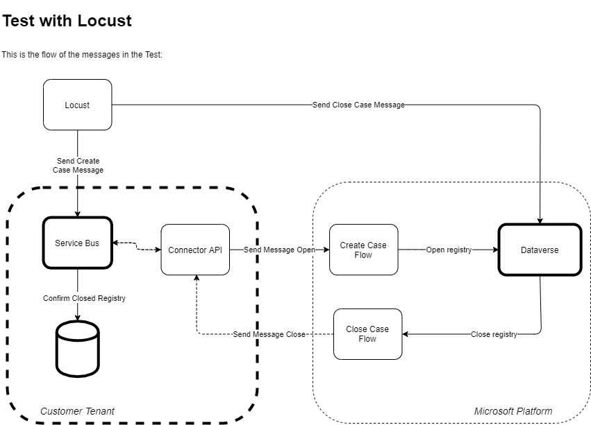

# Automated testing in Dataverse and Power Platform

Testing applications in Power Platform may be a challenge when you have it integrated
with different services hosted elsewhere.

This recipe is to serve as a starting point for anyone that wants to execute tests
using Locust in Power Platform.

There are two documents:

- [locustfile_py.md](locustfile_py.md); and
- [dockerfile-docker-compose.md](dockerfile-docker-compose.md)

The first file, *locustfile_py.md* is a sample of a script that will run some tests
in Power Platform and [Dynamics Field Service](https://dynamics.microsoft.com/field-service/overview/).

The *dockerfile-docker-compose.md* is a sample Docker configuration file that can
be used in case you want to have other people, or a CI/CD pipeline, running the tests
using the same version everywhere.
